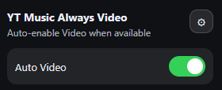

# 📺 YT Music Always Video

Automatically enables **video playback on YouTube Music** when a video version is available.

This lightweight browser extension saves you from manually switching from **Song** to **Video** while listening on YouTube Music.

---

## ✨ Features

- Automatically switches to **Video mode** when available
- Designed specifically for **YouTube Music**
- Simple popup with an **Auto Video toggle**
- Optional **theme selector** (System / Light / Dark)
- Lightweight and fast
- No tracking, no ads, no accounts

---

## 📸 Screenshot

---

## 🌐 Supported Browsers (Chromium)

This extension supports **Chromium-based browsers**, including:

- ✅ Opera
- ✅ Opera GX
- ✅ Google Chrome
- ✅ Microsoft Edge
- ✅ Brave
- ✅ Vivaldi

Firefox support may be added in the future.

---

## 🛒 Installation

The extension is available through official browser extension stores.

- **Opera / Opera GX** → Opera Add-ons  
- **Chrome / Edge / Brave / Vivaldi** → Chrome Web Store  

No manual installation is required.

---

## 🛠 How It Works

When you play a track on **YouTube Music**:

1. The extension checks if a video version is available
2. If available, it automatically switches to **Video mode**
3. If not available, playback remains unchanged

You can enable or disable this behavior at any time using the **Auto Video** toggle in the extension popup.

---

## 🔐 Permissions Explained

| Permission | Purpose |
|------------|---------|
| `storage` | Saves your preferences (Auto Video, Theme) |
| `tabs` | Detects the active YouTube Music tab |
| Site access | Runs only on `music.youtube.com` |

The extension does **not** access other websites.

---

## 🔒 Privacy Policy

This extension does **not** collect, store, transmit, or share any personal data.

All settings are stored locally using the browser’s storage API and are used only to control the extension’s behavior.

The extension does not use analytics, tracking, advertising, or external servers.

---

## 📄 License

This project is licensed under the **MIT License**.

See the `LICENSE` file for details.

---

## 👤 Author

Created by **PerfectGoose6573**

---

## 💬 Support

If you find a bug or have a suggestion, please open an issue on GitHub:

👉 https://github.com/Perfectgoose6573/YT-Music-Always-Video/issues
